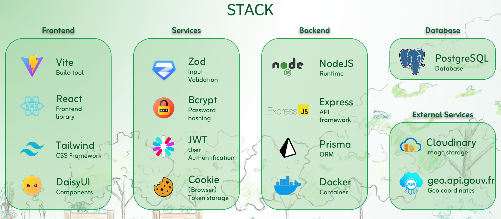
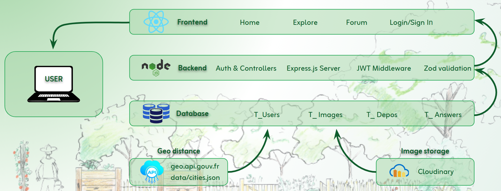
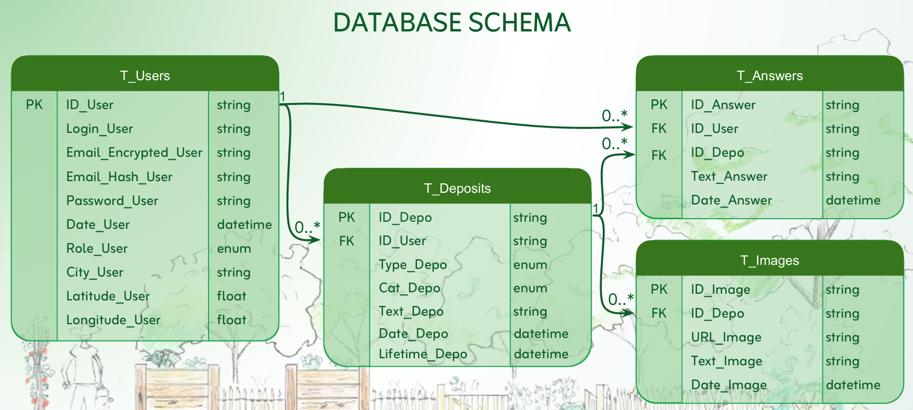
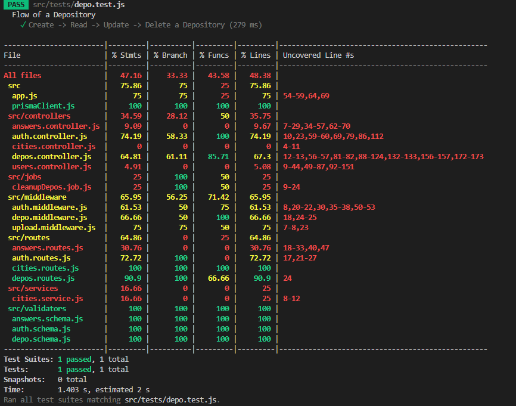
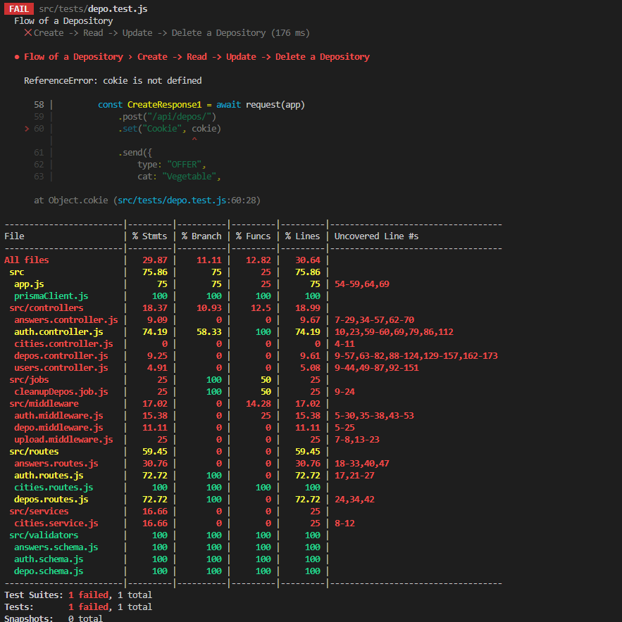

# Welcome on ShareUp Application!

ShareUp is a web Application created by the Lyonx team, composed of RENAUD Vincent and MESSAOUDI Enzo, which consist of offering or requesting garden products and discussion around the garden between many person.

### Navigation
- [Team Formation Overview](#team-formation-overview)
- [Ideas Explored](#ideas-explored)
- [How does the application work ?](#how-does-the-application-work)
- [Stack Choice](#stack-choice)
- [System Architecture](#system-architecture)
- [Database Diagram](#database-diagram)
- [LOADING COMMANDS](#loading-commands)
- [SETUP docker](#setup-docker)
- [RUN container](#run-container)
- [SETUP PRISMA](#setup-prisma)
- [PRISMA COMMANDS to restart from DataBase](#prisma-commands-to-restart-from-database)
- [SETUP TURF](#setup-turf)
- [How does we test our endpoints?](#how-does-we-test-our-endpoints)
- [Application Structure](#application-structure)

## Team Formation Overview
- [Return at the top](#welcome-on-shareup-application)

Following our shared project on the Simple Shell, we developed a strong sense of cohesion and alignment in our way of working. After some consideration, we decided to form a team made up of Enzo M. (backend) and Vincent R. (frontend) under the name LYONX.

Roles were assigned naturally based on each person’s comfort zone; however, the work is carried out collaboratively via Discord and GitHub, with daily remote communication and in-person meetings once a week.

## Ideas Explored
- [Return at the top](#welcome-on-shareup-application)

For starter, we defined a few key criteria:
- Public usefulness: addressing a real need
- Simplicity in design combined with a variety of features
- Use of modern languages and technologies

We search for inspiration from people around us to identify everyday needs and expectations on a simple level.

Then we oriented the idea around a responsive web application, with database management and user authentication features.

We chose a JavaScript-based technology stack for both frontend and backend to maintain consistency, along with modern frameworks such as Vite and React.

Several ideas were collected and analyzed before selecting the one that met all our criteria:

		A platform for exchanging goods for garden lovers named ShareUP.


## How does the application work?
- [Return at the top](#welcome-on-shareup-application)

When the user arrive on ShareUp, he will appear on the Home Page. On this one, he can read infos about the application(What the application is about, why it was created etc.).

If he want to login, there is a button at the top right of any page named "Login". The user will be directed to a login page where he will login with his email and password. If he doesn't have a account yet, he can click on "doesn't have an account ? Click here to register". There, he will be redirected to the register page. To register, the user will have to enter his username, city, email and password.

On the Market Page, the user can explore all the ads other users posted. There can be Offer or Request. The user can use filter to search what he need or what other need and where. The user can only create an ad if he is connected, the button appaears at the top of the page. To create an Ad, the user have to say what type of ad it is (Offer or request), what type he want or have (vegetables, organci matter or other), the title, description, lifetime and if there is a photo.

When the user click on a ad he is interested about, he can see all the infos about it (Title, full description, lifetime, more photos). At the bottom of the ad are the answers of the depo where the user can ask question about it and communicate about how to pick it up.

Futher, there is the Forum. On this page, the user can communicate with other users on a variety of subject about the garden, ask questions etc. He can also ask question about the application.

Finally, the user can see all his infos in the dashboard page. It only appear at the top right of the page when he is connected. In the dashboard, the user can see all his depos easily, edit or delete them.

## Stack Choice
- [Return at the top](#welcome-on-shareup-application)  


## System Architecture
- [Return at the top](#welcome-on-shareup-application)  


## Database Diagram
- [Return at the top](#welcome-on-shareup-application)  



## LOADING COMMANDS
- [Return at the top](#welcome-on-shareup-application)  

- Terminal 1: `~/portfolio/`

    1. npm run dev
    2. npm run rebuild
    3. npm run clean

        - *1,2 and 3 auto-open the browser when frontend is ready.*
        - *Can fail sometimes with WSL*

    4. npm run stop

- Terminal 2: `~/portfolio/backend/$`

    5. npm run studio

### 1. Usual development (restart from the last time)

`~/portfolio/`

```
npm run dev

# docker compose -f docker-compose.dev.yml up -d
```

- Starts containers (frontend, backend, postgres)
- Reuses existing Docker layers (fast startup)
- Keeps existing database state
- Keeps Prisma data intact

### 2. Rebuild containers (no cache, full refresh)

`~/portfolio/`

```
npm run rebuild

# docker compose -f docker-compose.dev.yml up --build -d
```

#### When to use:

- Docker is not picking up code changes
- Strange runtime errors after updates
- After dependency changes (package.json changes)

#### What it does:

- Recreates containers even if they already exist
- Rebuilds images from scratch (ignores cached container state)
- Keeps PostgreSQL data volume intact
- Keeps database data

### 3. Full reset (Prisma / seed / DB changes)

`~/portfolio/`

```
npm run clean

# docker compose -f docker-compose.dev.yml down -v && npm run rebuild
```

#### When to use:

- Prisma schema changed
- Seeder logic changed
- Want a completely fresh database
- DB state is corrupted or outdated

#### What it does:

- Stops all containers
- Deletes containers + all volumes
- Removes PostgreSQL data completely
- Recreates database from scratch
- Runs:
  - Prisma migrations
  - Seed script (automatic on backend start)

### 4. Stop the containers at the end of the day (restard with dev)
*Usually `Ctr + C` is enough but with -d, the logs are not visible*

`~/portfolio/`

```
npm run stop

# docker compose -f docker-compose.dev.yml down
```

- Stop containers
- Remove containers
- Remove default network

### 5. Check the DataBase inside the docker (use another terminal)

`~/portfolio/backend/$`

```
npm run studio

// The first time run:
npm install --save-dev dotenv-cli
```

### Development Ports

| Port | Service                 |
| ---- | ----------------------- |
| 5000 | Backend API (Express)   |
| 5173 | Frontend (Vite + React) |
| 5433 | PostgreSQL Database     |
| 5555 | Prisma Studio           |

## SETUP docker
- [Return at the top](#welcome-on-shareup-application)

`~/portfolio/$`

```
sudo apt update
sudo apt  install docker.io -y
```

```
which docker         # /usr/bin/docker
docker --version     # version 29.1.3-0ubuntu3~24.04.1

```

```
sudo apt-get install docker-compose-plugin
docker compose version              # Docker Compose version v5.1.3
```

Add user to the docker group

```
sudo usermod -aG docker $USER
```

verify Docker is working

```
docker ps
```

### To restard Docker

```
sudo systemctl restart docker
```

## RUN container
- [Return at the top](#welcome-on-shareup-application)

```
docker exec -it portfolio-backend-1 sh
```

run the migration inside the container

```
# npx prisma migrate deploy --schema=prisma/schema.prisma
```

### Pull from library/postgres

```
docker pull postgres
```

## SETUP PRISMA
- [Return at the top](#welcome-on-shareup-application)

```
npm install prisma@6 @prisma/client@6   # 7 works differently
```

## PRISMA COMMANDS to restart from schema.prisma
- [Return at the top](#welcome-on-shareup-application)

### 1. Stop Docker and delete the database

`~/portfolio/$`

```
docker compose -f docker-compose.dev.yml down -v
```

### 2. Delete existing migrations

`~/portfolio/backend/$`

```
rm -rf prisma/migrations
```

### 3. Start PostgreSQL ans backend containers

(Need a database running to generate migrations)

`~/portfolio/$`

```
docker compose -f docker-compose.dev.yml up postgres backend -d
```

Wait the time to process.

### 4. Create a fresh migration inside the docker

`~/portfolio/backend`

```
docker compose exec backend npx prisma migrate dev --name init
```

### 5. Rebuild containers

`~/portfolio`

```
npm run clean
```

### Generate User

```
npx prisma generate
```

### Generate Admin and uknown user

- localy:

```
npx prisma db seed
```

- in the container:

```
docker compose exec backend npx prisma db seed
```

### 6. Check the DataBase localy

`~/portfolio/backend/$`

```
npx prisma studio //port:5555
```

## PRISMA COMMANDS to restart from DataBase
- [Return at the top](#welcome-on-shareup-application)

### Adjust schema.prisma to match current DataBase

```
npx prisma db pull
```

## SETUP TURF
- [Return at the top](#welcome-on-shareup-application)

`~/portfolio/frontend/$`

```
npm install @turf/turf
```

## How does we test our endpoints?
- [Return at the top](#welcome-on-shareup-application)

We use Jest to create a test file easily then we test our endpoint with supertest

if you change the prisma schema, you have to use this command:

```
npx dotenv -e .env.test -- prisma migrate deploy
```

`~/portfolio/backend/$`

Command to test the authentification endpoint:

```
npm test src/tests/auth.test.js
```

Command to test the depo endpoint:
```
npm test src/tests/depo.test.js
```

Command to terst the answers endpoint:
```
npm test src/tests/answers.test.js
```

### If everything is fine, the result should look like this:



### If there is an error in the test file and it does not return what was expected:




## Application Structure
- [Return at the top](#welcome-on-shareup-application)

Command to run at the root of the application:
```
tree -I node_modules
```

```
.
├── Dockerfile
├── Presentation - Portfolio project Foundations v3.pdf
├── Production.png
├── README.md
├── README_PERSO.md
├── Stage_1_En.md
├── Stage_1_Fr.md
├── Technos.png
├── backend
│   ├── README.md
│   ├── config
│   │   └── cloudinary.js
│   ├── coverage
│   │   ├── clover.xml
│   │   ├── coverage-final.json
│   │   ├── lcov-report
│   │   │   ├── base.css
│   │   │   ├── block-navigation.js
│   │   │   ├── config
│   │   │   │   ├── cloudinary.js.html
│   │   │   │   └── index.html
│   │   │   ├── favicon.png
│   │   │   ├── index.html
│   │   │   ├── prettify.css
│   │   │   ├── prettify.js
│   │   │   ├── services
│   │   │   │   ├── cloudinary.service.js.html
│   │   │   │   └── index.html
│   │   │   ├── sort-arrow-sprite.png
│   │   │   ├── sorter.js
│   │   │   └── src
│   │   │       ├── app.js.html
│   │   │       ├── controllers
│   │   │       │   ├── answers.controller.js.html
│   │   │       │   ├── auth.controller.js.html
│   │   │       │   ├── cities.controller.js.html
│   │   │       │   ├── depos.controller.js.html
│   │   │       │   ├── index.html
│   │   │       │   └── users.controller.js.html
│   │   │       ├── index.html
│   │   │       ├── jobs
│   │   │       │   ├── cleanupDepos.job.js.html
│   │   │       │   └── index.html
│   │   │       ├── middleware
│   │   │       │   ├── auth.middleware.js.html
│   │   │       │   ├── depo.middleware.js.html
│   │   │       │   ├── index.html
│   │   │       │   └── upload.middleware.js.html
│   │   │       ├── prismaClient.js.html
│   │   │       ├── routes
│   │   │       │   ├── answers.routes.js.html
│   │   │       │   ├── auth.routes.js.html
│   │   │       │   ├── cities.routes.js.html
│   │   │       │   ├── depos.routes.js.html
│   │   │       │   └── index.html
│   │   │       ├── services
│   │   │       │   ├── cities.service.js.html
│   │   │       │   └── index.html
│   │   │       └── validators
│   │   │           ├── answers.schema.js.html
│   │   │           ├── auth.schema.js.html
│   │   │           ├── depo.schema.js.html
│   │   │           └── index.html
│   │   └── lcov.info
│   ├── docker-entrypoint.sh
│   ├── jest.config.mjs
│   ├── jest.setup.js
│   ├── package-lock.json
│   ├── package.json
│   ├── prisma
│   │   ├── migrations
│   │   │   ├── 20260619073817_init
│   │   │   │   └── migration.sql
│   │   │   └── migration_lock.toml
│   │   ├── schema.prisma
│   │   └── seed.js
│   ├── services
│   │   └── cloudinary.service.js
│   ├── src
│   │   ├── app.js
│   │   ├── controllers
│   │   │   ├── answers.controller.js
│   │   │   ├── auth.controller.js
│   │   │   ├── cities.controller.js
│   │   │   ├── depos.controller.js
│   │   │   └── users.controller.js
│   │   ├── data
│   │   │   └── cities.json
│   │   ├── jobs
│   │   │   └── cleanupDepos.job.js
│   │   ├── middleware
│   │   │   ├── answer.middleware.js
│   │   │   ├── auth.middleware.js
│   │   │   ├── depo.middleware.js
│   │   │   └── upload.middleware.js
│   │   ├── prismaClient.js
│   │   ├── routes
│   │   │   ├── answers.routes.js
│   │   │   ├── auth.routes.js
│   │   │   ├── cities.routes.js
│   │   │   └── depos.routes.js
│   │   ├── server.js
│   │   ├── services
│   │   │   └── cities.service.js
│   │   ├── tests
│   │   │   ├── answers.test.js
│   │   │   ├── assets
│   │   │   │   └── test-image.jpg
│   │   │   ├── auth.test.js
│   │   │   └── depo.test.js
│   │   └── validators
│   │       ├── answers.schema.js
│   │       ├── auth.schema.js
│   │       └── depo.schema.js
│   └── uploads
├── docker-compose.dev.yml
├── docker-compose.yml
├── frontend
│   ├── Dockerfile.dev
│   ├── ProtectedRoute.jsx
│   ├── README.md
│   ├── eslint.config.js
│   ├── index.html
│   ├── package-lock.json
│   ├── package.json
│   ├── postcss.config.js
│   ├── public
│   │   ├── _redirects
│   │   ├── favicon.ico
│   │   ├── fonts
│   │   │   ├── Zain-Black.woff2
│   │   │   ├── Zain-Bold.woff2
│   │   │   ├── Zain-ExtraBold.woff2
│   │   │   ├── Zain-ExtraLight.woff2
│   │   │   ├── Zain-Italic.woff2
│   │   │   ├── Zain-Light.woff2
│   │   │   ├── Zain-LightItalic.woff2
│   │   │   └── Zain-Regular.woff2
│   │   ├── icons
│   │   │   ├── Logo_16x16.png
│   │   │   ├── Logo_180x180.png
│   │   │   ├── Logo_192x192.webp
│   │   │   ├── Logo_192x192_bg.png
│   │   │   ├── Logo_32x32.png
│   │   │   ├── Logo_512x512.webp
│   │   │   └── Logo_512x512_bg.png
│   │   └── manifest.json
│   ├── src
│   │   ├── App.jsx
│   │   ├── api.js
│   │   ├── assets
│   │   │   ├── Arrows_512x512.png
│   │   │   ├── Coupe+Saint+Leu+copy.webp
│   │   │   ├── Logo_512x353.webp
│   │   │   ├── ShareUp_512x512.png
│   │   │   ├── dessin_jardin.png
│   │   │   └── dessin_jardin.webp
│   │   ├── components
│   │   │   ├── AnimatedFlatLogo.jsx
│   │   │   ├── AnimatedFlatLogo_infinite.jsx
│   │   │   ├── Animated_logo.jsx
│   │   │   ├── CitySelect.jsx
│   │   │   ├── CustomButton.jsx
│   │   │   ├── CustomSelect.jsx
│   │   │   ├── DepoCards
│   │   │   │   ├── DashboardDepoCard.jsx
│   │   │   │   └── PublicDepoCard.jsx
│   │   │   ├── DeposList.jsx
│   │   │   ├── Dock.jsx
│   │   │   ├── FilterBar.jsx
│   │   │   ├── Footer.jsx
│   │   │   ├── InputField.jsx
│   │   │   ├── MarketLocationFilter.jsx
│   │   │   ├── Modal.jsx
│   │   │   ├── Navbar.jsx
│   │   │   ├── ProtectedRoute.jsx
│   │   │   ├── UserMenu.jsx
│   │   │   └── ValidationCheck.jsx
│   │   ├── config
│   │   │   └── deposConfig.js
│   │   ├── constants
│   │   │   ├── categories_faq.js
│   │   │   ├── categories_market.js
│   │   │   └── shareItems.js
│   │   ├── context
│   │   │   ├── AuthContext.jsx
│   │   │   ├── AuthProvider.jsx
│   │   │   └── useAuth.js
│   │   ├── daisyui.d.ts
│   │   ├── hooks
│   │   │   ├── useAuth.js
│   │   │   ├── useClickOutside.js
│   │   │   ├── useDepos.js
│   │   │   ├── useFilterSummary.js
│   │   │   └── useInView.js
│   │   ├── index.css
│   │   ├── layouts
│   │   │   └── MainLayout.jsx
│   │   ├── main.jsx
│   │   ├── pages
│   │   │   ├── Dashboard.jsx
│   │   │   ├── Depo.jsx
│   │   │   ├── DeposPage.jsx
│   │   │   ├── Faq.jsx
│   │   │   ├── Home.jsx
│   │   │   ├── Login.jsx
│   │   │   ├── Market.jsx
│   │   │   ├── NotFound.jsx
│   │   │   └── SignUp.jsx
│   │   ├── services
│   │   │   └── city.service.js
│   │   └── utils
│   │       ├── date.js
│   │       ├── geo.js
│   │       ├── plural.js
│   │       └── select.js
│   ├── tailwind.config.js
│   └── vite.config.js
├── package-lock.json
├── package.json
└── scripts
    └── dev.js
```
